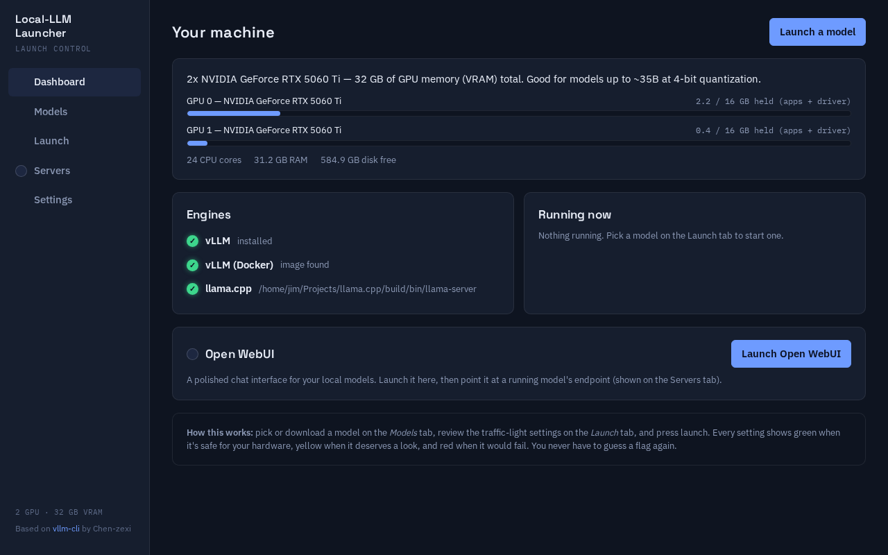
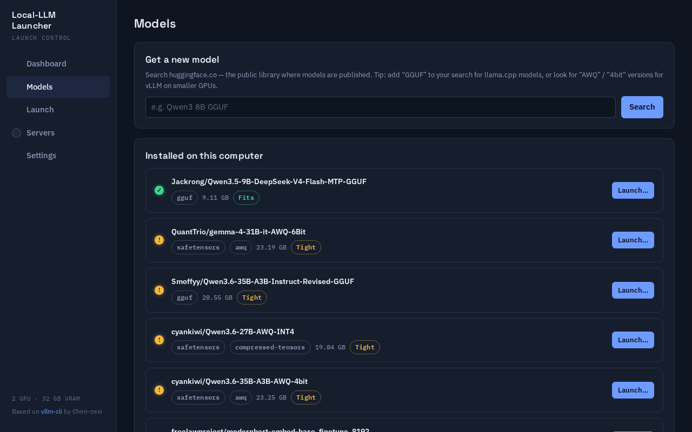
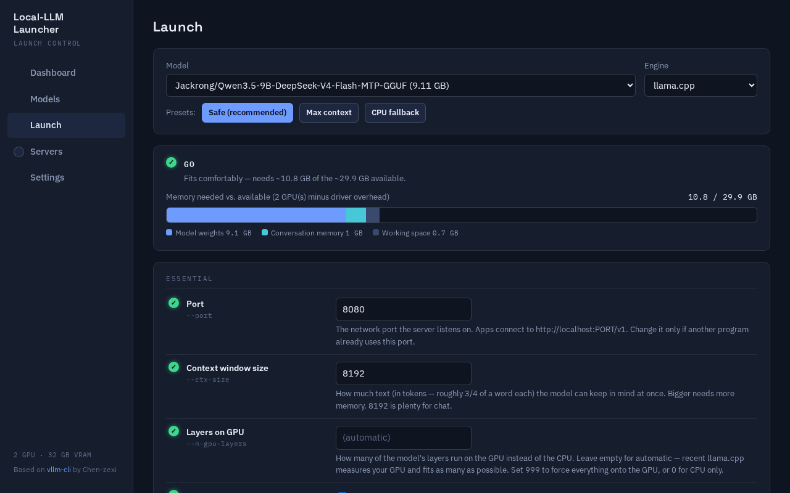

# Local-LLM-Launcher-GUI

> This app was developed off excellent work by Chen-zexi on
> [vllm-cli](https://github.com/Chen-zexi/vllm-cli): many thanks for the CLI
> version, which the author recommends for use when VRAM is tight (booting
> into a TTY without a display server can free over 1 GB of GPU memory). The
> idea behind this project was the frustration that comes with attempting to
> squeeze LLMs of various types onto individual hardware. The flags are
> cryptic, loading fails frequently, and documentation is not always helpful.
> This is an effort to help the local LLM community more easily run models —
> measuring available memory, making suggestions, and adjusting settings so a
> model can run without hours of trial and error. Or at least, fewer hours of
> trial and error.
>
> *Read the full story (and a shoutout to the AI that built this) in
> [docs/ABOUT.md](docs/ABOUT.md).*

---

A friendly, browser-based control panel for downloading and running large
language models ("LLMs" — the AI models behind chatbots like ChatGPT, except
running on **your own computer**) using **vLLM** or **llama.cpp**. Built for
people who don't want to memorize cryptic command-line flags or spend an
afternoon guessing why a model won't load.

Every setting is rated 🟢 / 🟡 / 🔴 (green / yellow / red) **against your
actual computer and the model you picked**, with a one-or-two-sentence
plain-English explanation. A live "fuel gauge" shows whether the model will
fit *before* you click launch. If a launch fails anyway, the app translates
the error into something you can actually act on.



> **Experimental: SGLang support.** An
> [`experimental/sglang-integration`](https://github.com/jimdawdy-hub/Local-LLM-Launcher-GUI/tree/experimental/sglang-integration)
> branch adds [SGLang](https://github.com/sgl-project/sglang) as a fourth
> engine. It is **unstable** — upstream bugs in `apache-tvm-ffi` cause
> processor loading failures and JIT crashes, especially on NVIDIA Blackwell
> GPUs (RTX 5060 Ti). Testing only; vLLM and llama.cpp remain the reliable
> options.

---

## What you need before you start

1. **A computer that can run local AI models.** In practice this means:
   - A reasonably modern NVIDIA graphics card (8 GB+ of VRAM is a comfortable
     starting point), **or**
   - An Apple Silicon Mac (M1/M2/M3/M4), **or**
   - Just a CPU and enough RAM — works, but slower, for smaller models.
2. **Python 3.10 or newer.** Most Macs and Linux systems already have this.
   On Windows, install it from [python.org](https://www.python.org/downloads/)
   (tick "Add Python to PATH" during install).
3. **At least one "engine"** — the program that actually runs the model:
   - **[llama.cpp](https://github.com/ggml-org/llama.cpp)** — easiest to set
     up, works almost everywhere, uses `.gguf` model files. Recommended for
     most people starting out.
   - **[vLLM](https://docs.vllm.ai)** — faster for NVIDIA GPUs, uses
     HuggingFace-format models. Install via `pip install vllm` or use their
     Docker image.

   Don't worry too much about choosing — the app detects what you have
   installed and tells you what's missing, with instructions, on the
   **Settings** page.

## Getting it running

Open a terminal (on Windows: search for "Command Prompt" or "PowerShell"; on
Mac: search for "Terminal"; on Linux: you know where it is) and run:

```bash
# 1. Get the code
git clone https://github.com/jimdawdy-hub/Local-LLM-Launcher-GUI
cd Local-LLM-Launcher-GUI

# 2. (Recommended) create an isolated Python environment
python -m venv .venv
source .venv/bin/activate          # Windows: .venv\Scripts\activate

# 3. Install the app
pip install .

# 4. Run it
local-llm-launcher
```

Your web browser should open automatically to `http://127.0.0.1:8765`. If it
doesn't, open that address yourself. **This only runs on your own computer —
nothing is sent anywhere else**, and no other device on your network can
reach it. If port 8765 is already in use, the app automatically picks the next
free port and tells you in the terminal.

To stop the app, go back to the terminal window and press `Ctrl+C`.

## Using it — the short version

1. **Dashboard** — confirms the app can see your hardware (GPU, memory) and
   which engines (vLLM / llama.cpp) it found. There's also a one-click
   launcher for **[Open WebUI](https://github.com/open-webui/open-webui)** — a
   polished chat interface — right under "Running now." If it's not installed,
   the button is greyed out with the install command ready to copy; if it is,
   clicking it starts Open WebUI, connects it to whatever models you have
   running, and opens it in your browser automatically.
2. **Models** — search for a model on HuggingFace (the most popular library of
   AI models) and download it, or see what you've already got. Each model
   shows whether it'll **Fit**, be **Tight**, or **Won't fit** on your
   hardware.
   
3. **Launch** — pick a model, pick a preset (or leave it on *Safe*), and read
   the big green/yellow/red verdict at the top. Every setting below it has a
   plain-English explanation and its own status light. For models that can
   also see images or hear audio, a **Text-only mode** toggle skips loading
   that part to free up memory for chat. When it's green, hit **Launch**.
   Under **Advanced**, there's also a **KV cache to system RAM** option for
   edge cases where the model fits on the GPU but conversation memory doesn't
   — it comes with a clear speed penalty warning.
   
4. **Servers** — see your running model, copy its address to use in other
   apps, watch its logs, or try it right there with the built-in test chat.
   If something failed, this page explains why in plain language.
5. **Settings** — add your HuggingFace account token (only needed for
   models that require accepting a license), point the app at extra model
   folders, or fix the path to `llama-server` if it wasn't found
   automatically.

## What "Fit / Tight / Won't fit" means

The app adds up how much memory (VRAM, on a GPU) a model needs — its weights,
plus a working memory area for the conversation — and compares it to how much
your hardware actually has free **right now**:

- 🟢 **Fits** — plenty of room, should start without issue.
- 🟡 **Tight** — it should work, but there's not much to spare. The app will
  point out what to watch for (e.g. "close your browser first").
- 🔴 **Won't fit** — launching would fail. The app explains why and what
  smaller/compressed alternative might work instead.

These numbers update live, because how much memory is "free" changes as you
open and close other programs.

Behind the scenes, vLLM checks memory in **two separate steps** when starting
up: first it loads the model's weights, then it reserves room for the
conversation (the "KV cache"). A model can pass the first check and still fail
the second — loading successfully and then refusing to start. The app checks
*both* steps before you launch, so a "should load but then fail at the last
second" scenario shows up as a yellow warning with a fix (shorter context,
more memory headroom, or compression) instead of a 10-15 minute wait followed
by a cryptic error.

## Learn more

- **[docs/ABOUT.md](docs/ABOUT.md)** — the full story behind this project,
  why both vLLM and llama.cpp are supported, and credit to Anthropic's
  Claude, which built it.
- **[docs/VLLM_CLI_BACKGROUND.md](docs/VLLM_CLI_BACKGROUND.md)** — how the
  original vllm-cli works and exactly what changed here.
- **[docs/ARCHITECTURE.md](docs/ARCHITECTURE.md)** — technical deep dive:
  stack choices, module map, the advisor's memory math.
- **[docs/CHANGELOG.md](docs/CHANGELOG.md)** — granular history of what was
  built and fixed, including real failures encountered on real hardware.
- **[docs/CONTRIBUTING.md](docs/CONTRIBUTING.md)** — how to contribute,
  including a warm welcome to "vibe coders" (people contributing with the
  help of an AI assistant — that's how this whole project was made!).

## Credits

- **[vllm-cli](https://github.com/Chen-zexi/vllm-cli)** by **Chen-zexi** (MIT
  license) — the flag catalog concept, configuration profiles, server
  lifecycle management, and model discovery approach are adapted from this
  project. Thank you!
- **[vLLM](https://github.com/vllm-project/vllm)** and
  **[llama.cpp](https://github.com/ggml-org/llama.cpp)** — the engines that
  do the actual work.
- Built with **Claude Fable 5** (Anthropic). Thank you to **Anthropic** for
  an amazing product — see [docs/ABOUT.md](docs/ABOUT.md) for the full story.

## License

MIT — see [LICENSE](LICENSE). Portions adapted from
[vllm-cli](https://github.com/Chen-zexi/vllm-cli), © Chen-zexi, MIT license.
