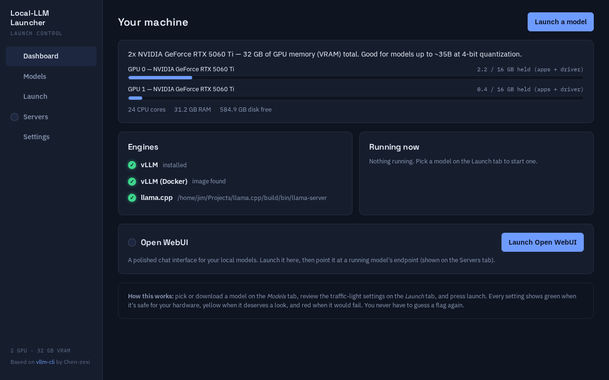
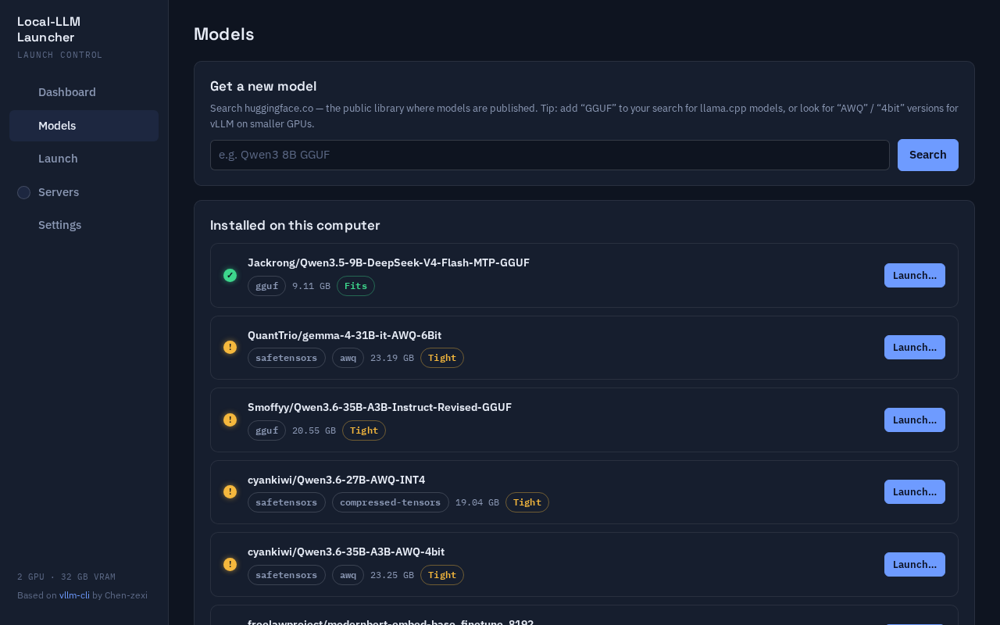
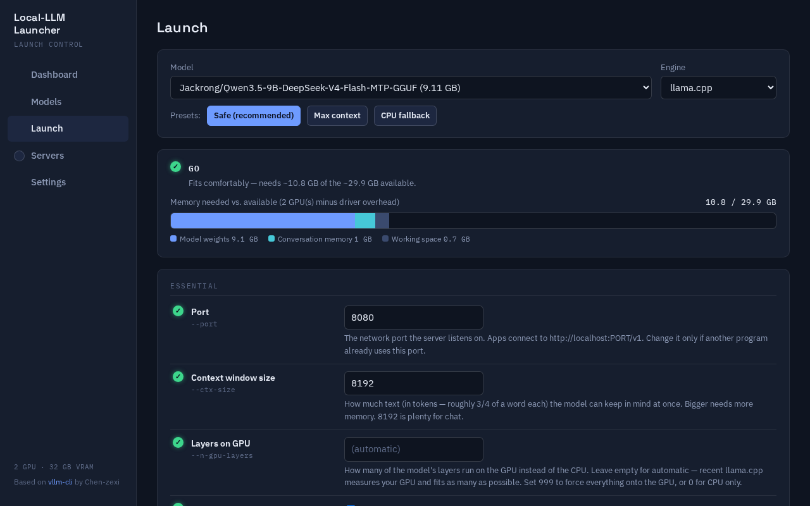

# Local-LLM-Launcher-GUI

> This app was developed off excellent work by Chen-zexi on
> [vllm-cli](https://github.com/Chen-zexi/vllm-cli): many thanks for the CLI
> version, which the author recommends for use when VRAM is tight (booting
> into a TTY without a display server can free over 1 GB of GPU memory). The
> idea behind this project was the frustration that comes with attempting to
> squeeze LLMs of various types onto individual hardware. The flags are
> cryptic, loading fails frequently, and documentation is not always helpful.
> This is an effort to help the local LLM community more easily run models —
> measuring available memory, making suggestions, and adjusting settings so a
> model can run without hours of trial and error. Or at least, fewer hours of
> trial and error.
>
> *Read the full story (and a shoutout to the AI that built this) in
> [docs/ABOUT.md](docs/ABOUT.md).*

---

A friendly, browser-based control panel for downloading and running large
language models ("LLMs" — the AI models behind chatbots like ChatGPT, except
running on **your own computer**) using **vLLM** or **llama.cpp**. Built for
people who don't want to memorize cryptic command-line flags or spend an
afternoon guessing why a model won't load.

Every setting is rated 🟢 / 🟡 / 🔴 (green / yellow / red) **against your
actual computer and the model you picked**, with a one-or-two-sentence
plain-English explanation. A live "fuel gauge" shows whether the model will
fit *before* you click launch. If a launch fails anyway, the app translates
the error into something you can actually act on.



> **Experimental: SGLang support.** An
> [`experimental/sglang-integration`](https://github.com/jimdawdy-hub/Local-LLM-Launcher-GUI/tree/experimental/sglang-integration)
> branch adds [SGLang](https://github.com/sgl-project/sglang) as a fourth
> engine. It is **unstable** — upstream bugs in `apache-tvm-ffi` cause
> processor loading failures and JIT crashes, especially on NVIDIA Blackwell
> GPUs (RTX 5060 Ti). Testing only; vLLM and llama.cpp remain the reliable
> options.

---

## What you need before you start

1. **A computer that can run local AI models.** In practice this means:
   - A reasonably modern NVIDIA graphics card (8 GB+ of VRAM is a comfortable
     starting point), **or**
   - An Apple Silicon Mac (M1/M2/M3/M4), **or**
   - Just a CPU and enough RAM — works, but slower, for smaller models.
2. **Python 3.10 or newer.** Most Macs and Linux systems already have this.
   On Windows, install it from [python.org](https://www.python.org/downloads/)
   (tick "Add Python to PATH" during install).
3. **At least one "engine"** — the program that actually runs the model:
   - **[llama.cpp](https://github.com/ggml-org/llama.cpp)** — easiest to set
     up, works almost everywhere, uses `.gguf` model files. Recommended for
     most people starting out.
   - **[vLLM](https://docs.vllm.ai)** — faster for NVIDIA GPUs, uses
     HuggingFace-format models. Install via `pip install vllm` or use their
     Docker image.

   Don't worry too much about choosing — the app detects what you have
   installed and tells you what's missing, with instructions, on the
   **Settings** page.

## Getting it running

### Optional vLLM backend tuning

Launch → Advanced settings includes **linear**, **MoE** (mixture-of-experts),
and **attention** backends (alternative implementations of the model's calculations).
Leave them **automatic** unless comparing a particular implementation. vLLM
0.30 already improves automatic NVFP4 selection (4-bit model computation) on
compatible RTX 50-series models; selecting a backend does not convert a model
to that format.

The optional `b12x` implementations target SM120/121 (GPU capability versions,
including the RTX 5060 Ti). Install the `vllm[b12x]` extra in **the same Python
environment as the configured vLLM executable**, preserving your chosen vLLM
version. Docker users need the dependency inside their image. The launcher
does not install it automatically.

For vLLM 0.30 the attention selector is **`B12X`**, despite earlier release
discussion using `B12X_ATTN`. It requires BF16 (16-bit brain floating point)
model computation and compatible conversation memory, and cannot split context
processing across GPUs. A model stored in float32 qualifies when precision is
left on automatic, because vLLM runs it as BF16 on these GPUs. B12X MoE also
has model-format restrictions and cannot use expert parallelism (splitting
experts among separate workers).

Native checks inspect the selected executable, not the launcher's Python.
Unavailable checks are shown as unverified; Docker runtime/package support is
always unverified here. The first check of a vLLM installation can take up to
a minute while vLLM loads its libraries: the Launch page shows "still being
checked" in the meantime, and **Launch** waits for the answer. Results are
reused for 10 minutes and rechecked as soon as you install or upgrade packages
in that environment. Options typed in **Extra arguments** are checked the way
vLLM reads them, including underscore spellings such as `--linear_backend`.
Package presence and recognized flags do not guarantee
a model will run or be faster. Compare performance on your own GPU before
keeping an override. See the [versioned B12X documentation](https://github.com/vllm-project/vllm/blob/v0.30.0/docs/features/quantization/b12x.md).

### Install the launcher

Open a terminal (on Windows: search for "Command Prompt" or "PowerShell"; on
Mac: search for "Terminal"; on Linux: you know where it is) and run:

```bash
# 1. Get the code
git clone https://github.com/jimdawdy-hub/Local-LLM-Launcher-GUI
cd Local-LLM-Launcher-GUI

# 2. (Recommended) create an isolated Python environment
python -m venv .venv
source .venv/bin/activate          # Windows: .venv\Scripts\activate

# 3. Install the app
pip install .

# 4. Run it
local-llm-launcher
```

Your web browser should open automatically to `http://127.0.0.1:8765`. If it
doesn't, open that address yourself. **This only runs on your own computer —
nothing is sent anywhere else**, and no other device on your network can reach
it. (Model servers and Open WebUI follow the same loopback-only rule unless
you turn on the **LAN access** toggle in Settings, which binds them to
`0.0.0.0` for other devices on your network.) If port 8765 is already in use,
the app automatically picks the next free port and tells you in the terminal.

To stop the app, go back to the terminal window and press `Ctrl+C`.

**Reaching it from your other devices through Tailscale (optional).** The app
still listens only on this computer; Tailscale's `serve` feature forwards your
private tailnet to it. Start the app with the address Tailscale gives you:

```bash
local-llm-launcher --no-browser --allow-host mybox.tailnet-name.ts.net
tailscale serve --bg --https=8765 http://127.0.0.1:8765
```

Then open `https://mybox.tailnet-name.ts.net:8765` on any device in your
tailnet. `--allow-host` accepts exact names only (no wildcards) and can be
repeated. Engine source updates stay available only from the computer itself.

## Using it — the short version

1. **Dashboard** — confirms the app can see your hardware (GPU, memory) and
   which engines (vLLM / llama.cpp) it found. There's also a one-click
   launcher for **[Open WebUI](https://github.com/open-webui/open-webui)** — a
   polished chat interface — right under "Running now." If it's not installed,
   the button is greyed out with the install command ready to copy; if it is,
   clicking it starts Open WebUI, connects it to whatever models you have
   running, and opens it in your browser automatically.
2. **Models** — search for a model on HuggingFace (the most popular library of
   AI models) and download it, or see what you've already got. Each model
   shows whether it'll **Fit**, be **Tight**, or **Won't fit** on your
   hardware. When a model ships the same weights in several formats, only the
   copy vLLM loads (safetensors, not older `.bin` files) is downloaded and
   counted.
   
3. **Launch** — pick a model, pick a preset (or leave it on *Safe*), and read
   the big green/yellow/red verdict at the top. Every setting below it has a
   plain-English explanation and its own status light. For models that can
   also see images or hear audio, a **Text-only mode** toggle skips loading
   that part to free up memory for chat. When it's green, hit **Launch**.
   Under **Advanced**, there's also a **KV cache to system RAM** option for
   edge cases where the model fits on the GPU but conversation memory doesn't
   — it comes with a clear speed penalty warning.
   
4. **Servers** — see your running model, copy its address to use in other
   apps, watch its logs, or try it right there with the built-in test chat.
   If something failed, this page explains why in plain language.
5. **Settings** — add your HuggingFace account token (only needed for
   models that require accepting a license), point the app at extra model
   folders, or fix the path to `llama-server` if it wasn't found
   automatically.

## Advanced hardware controls

### Choosing GPUs for vLLM

**Which GPUs to use** takes the GPU numbers shown by `nvidia-smi`, separated by
commas: `0,1` for both of two cards, `1` for just the second. Entries such as
`0 1` (a space instead of a comma) are refused with an explanation rather than
silently misread. For native vLLM the launcher sets
`CUDA_DEVICE_ORDER=PCI_BUS_ID`, so the numbers always match `nvidia-smi`. That
includes a `CUDA_VISIBLE_DEVICES` you set before starting the launcher, which
CUDA would otherwise number fastest card first. The memory advice budgets the
GPUs selected here, or those in `CUDA_VISIBLE_DEVICES` when this is empty. If
you add vLLM's own `--device-ids` under **Extra arguments**, it picks positions
within the GPUs selected here.

### llama.cpp placement

For llama.cpp, the advanced launch settings include:

- **GPU selection and proportions:** select the engine's device names and set
  `--tensor-split`, for example `3,1` for unequal cards or `40,40,40` for equal
  shares on three cards. These are proportions, not exact layer counts.
  `--split-mode layer` distributes layers and their conversation memory (KV
  cache) across the cards. The older `row` mode keeps KV on the main GPU;
  experimental `tensor` mode needs Flash Attention and remains model/backend
  dependent. Recent llama.cpp builds support `tensor` with compressed `q8_0`
  or `q4_0` K/V cache. Older builds may need updating; switching to `layer` or
  `f16` cache is another option. NVFP4 describes model weights, not the K/V
  cache: an NVFP4 GGUF can request Q8 conversation memory independently.
  Safetensors-format NVFP4 models still require an engine that loads that
  format, such as vLLM. See [upstream tensor/quantized-KV support](https://github.com/ggml-org/llama.cpp/pull/23792).
- **MoE expert placement:** `--cpu-moe` keeps all experts (the selectively used
  parts of a mixture-of-experts model) in RAM. `--n-cpu-moe N` keeps experts
  from the first N layers in RAM; reducing N lets more live on the GPU.
  Transfers between RAM and GPU can reduce speed. These controls cannot promise
  a precise memory fit without knowing the model's individual tensor sizes.
- **Microbatch size:** `--ubatch-size` limits how many tokens are processed
  together within a batch. Smaller values may reduce working memory at a speed
  cost.
- **NUMA:** on machines with multiple CPU/memory locality groups,
  `--numa distribute` spreads llama.cpp threads across nodes; `isolate` uses the
  startup node; `numactl` respects CPU placement arranged externally. The
  separate **Interleave memory** option wraps native llama.cpp or vLLM with
  `numactl --interleave=all`. It spreads memory allocations across allowed
  nodes and does not itself bind CPU threads. It requires Linux and `numactl`
  and does not apply to Docker launches.

NUMA options are off by default. They support ordinary multi-CPU computers as
well as VMs; recommendations use the nodes visible and allowed to the app.
A VM exposing one node cannot use these options to distribute work across
hidden host nodes. There is no automatic change to host configuration or system
page caches. Benchmark your workload before retaining a NUMA setting.

The existing memory-mapping and RAM-lock controls are translated to the newer
`--load-mode` syntax when the selected llama.cpp binary supports it. Older
binaries keep their legacy flags. Other advanced flags still depend on your
installed engine version; failed launches retain their logs for diagnosis.

The video linked in [issue #15](https://github.com/jimdawdy-hub/Local-LLM-Launcher-GUI/issues/15)
also uses a modified llama.cpp fork. Its expert prefetch/pinning optimizations
are not stock flags, and this launcher does not promise that video's speedup.

## Updating an engine from source

In **Settings → Build current engine source**, check requirements, inspect the
target commit (an exact source revision), then explicitly choose to build it.
Nothing is downloaded or upgraded automatically. Supported recipes are Linux
llama.cpp CPU/CUDA and Linux native vLLM with NVIDIA CUDA prerequisites.
Other platforms and Docker installations keep their manual installation path.

Builds download official upstream source and dependencies into separate folders
under the app data directory. Current source may contain unreleased changes.
Prerequisites and free disk space are checked before starting; compiler jobs
are limited to reduce CPU and memory pressure. Progress, recent output, and
failures appear in Settings. Only a validated executable is selected for future
launches. Running servers keep their existing executable, and older copies are
retained. You can restore an older executable path in Settings.

Use a browser directly on the launcher computer for these update controls.
A failed build keeps the previous engine selected, removes its downloaded
source and build environment to free disk space, and keeps its log. An
interrupted build (for example, if the launcher is closed) also leaves the
previous engine selected, but its partial files may remain in the app data
directory. The launcher must stay open to finish a
build and select its result.

## What "Fit / Tight / Won't fit" means

The app adds up how much memory (VRAM, on a GPU) a model needs — its weights,
plus a working memory area for the conversation — and compares it to how much
your hardware actually has free **right now**:

- 🟢 **Fits** — plenty of room, should start without issue.
- 🟡 **Tight** — it should work, but there's not much to spare. The app will
  point out what to watch for (e.g. "close your browser first").
- 🔴 **Won't fit** — launching would fail. The app explains why and what
  smaller/compressed alternative might work instead.

These numbers update live, because how much memory is "free" changes as you
open and close other programs.

Behind the scenes, vLLM checks memory in **two separate steps** when starting
up: first it loads the model's weights, then it reserves room for the
conversation (the "KV cache"). A model can pass the first check and still fail
the second — loading successfully and then refusing to start. The app checks
*both* steps before you launch, so a "should load but then fail at the last
second" scenario shows up as a yellow warning with a fix (shorter context,
more memory headroom, or compression) instead of a 10-15 minute wait followed
by a cryptic error.

## Learn more

- **[docs/ABOUT.md](docs/ABOUT.md)** — the full story behind this project,
  why both vLLM and llama.cpp are supported, and credit to Anthropic's
  Claude, which built it.
- **[docs/VLLM_CLI_BACKGROUND.md](docs/VLLM_CLI_BACKGROUND.md)** — how the
  original vllm-cli works and exactly what changed here.
- **[docs/ARCHITECTURE.md](docs/ARCHITECTURE.md)** — technical deep dive:
  stack choices, module map, the advisor's memory math.
- **[CHANGELOG.md](CHANGELOG.md)** — granular history of what was
  built and fixed, including real failures encountered on real hardware.
- **[docs/CONTRIBUTING.md](docs/CONTRIBUTING.md)** — how to contribute,
  including a warm welcome to "vibe coders" (people contributing with the
  help of an AI assistant — that's how this whole project was made!).

## Credits

- **[vllm-cli](https://github.com/Chen-zexi/vllm-cli)** by **Chen-zexi** (MIT
  license) — the flag catalog concept, configuration profiles, server
  lifecycle management, and model discovery approach are adapted from this
  project. Thank you!
- **[vLLM](https://github.com/vllm-project/vllm)** and
  **[llama.cpp](https://github.com/ggml-org/llama.cpp)** — the engines that
  do the actual work.
- Built with **Claude Fable 5** (Anthropic). Thank you to **Anthropic** for
  an amazing product — see [docs/ABOUT.md](docs/ABOUT.md) for the full story.

## License

MIT — see [LICENSE](LICENSE). Portions adapted from
[vllm-cli](https://github.com/Chen-zexi/vllm-cli), © Chen-zexi, MIT license.
